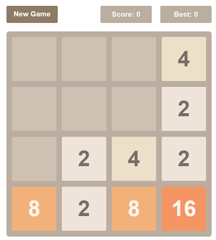

# GAME 2048

使用HTML+CSS+JS实现的2048游戏，前端练手。

- [x] 基本游戏逻辑
- [x] 任意尺寸棋盘——4×4、8×8...

- [ ] 分数计算

- [ ] 多端适配

- [ ] 悔步操作

剩下的坑，下学期再填吧，摸了。

提供一个游戏容器，将2048游戏挂载到此容器，即可愉快玩耍：

```html
<div id="game-container"></div>
```

```js
let game_container = document.querySelector('#game-container');
let game_2048 = new Game2048({
    "size": 480, // size(px) of the game panel
    "scale": 4, // 4×4、8×8...
}, game_container);
```



